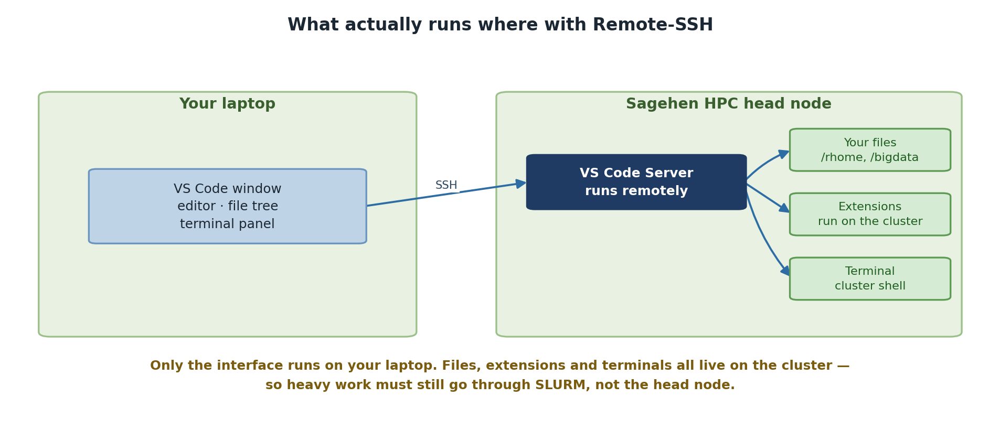

:::::::::::::::::::::::::::::::::::::: questions

- What is VS Code Remote-SSH and why would I use it?
- How does it compare to other tools for editing remote files?

::::::::::::::::::::::::::::::::::::::::::::::

::::::::::::::::::::::::::::::::::::: objectives

- Understand the benefits of using VS Code for remote HPC work
- Compare VS Code with traditional command-line alternatives
- Identify scenarios where VS Code is the best tool for the job

::::::::::::::::::::::::::::::::::::::::::::::

## What is VS Code Remote-SSH?

**Visual Studio Code (VS Code)** is a lightweight, modern code editor developed
by Microsoft. It is free, open-source, and available on Windows, Mac, and Linux.

**Remote-SSH** is an official Microsoft extension for VS Code that allows you to
connect to remote systems (like the Sagehen HPC cluster) and edit files as if
they were on your local machine. VS Code runs a server component on the remote
system while your local VS Code interface connects to it, giving you full IDE
features while working on the cluster.

Key insight: You are not editing files over SSH through a terminal emulator;
VS Code creates a true two-way connection with full IDE capabilities.

{alt='Two panels. On your laptop, the VS Code window provides the editor, file tree and terminal panel. Connected over SSH, the Sagehen HPC head node runs the VS Code Server, which in turn reaches your files in /rhome and /bigdata, extensions running on the cluster, and a terminal giving a cluster shell. A note explains that only the interface runs on your laptop, so heavy work must still go through SLURM rather than the head node.'}

## Comparison with Other Tools

::::::::::::::::::::::::::::::::::::: callout

## Command-Line Editors vs Modern IDE

**`nano`, `vim`, `emacs` pros:** Lightweight, fast, work in any SSH terminal,
no additional software needed.

**Cons:** Steep learning curve (especially vim), limited visual feedback, no
integrated file browser, difficult to manage large projects, no built-in
debugging or linting.

**When to use:** Quick edits to small files, slow connections, or very
resource-constrained remote systems.

::::::::::::::::::::::::::::::::::::::::::::::

**MobaXterm** offers an integrated SSH client and SFTP browser on Windows, but
is not a true IDE. **OnDemand** (Pomona's web interface at
https://ondemand.hpc.pomona.edu) is browser-based and good for job monitoring
and launching interactive applications, but has limited code editing.

## The VS Code Remote-SSH Workflow

```
Your Laptop (Local Machine)          Sagehen Cluster (Remote)
┌──────────────────────────┐        ┌──────────────────────┐
│   VS Code UI             │◄──────►│  VS Code Server      │
│   (Editor, Sidebar, etc.)│  SSH   │  (Files, Extensions) │
└──────────────────────────┘        └──────────────────────┘
         (Your view)                   (Where code runs)
```

When you open a folder on Sagehen HPC:

1. VS Code's user interface runs on your laptop
2. VS Code Server runs on the Sagehen HPC cluster (very lightweight)
3. File editing happens locally with VS Code's full features
4. Extensions run on the remote system where they access your files
5. The integrated terminal connects directly to the Sagehen login node

## Why Pomona Recommends VS Code for HPC

::::::::::::::::::::::::::::::::::::: callout

## Pomona's Recommended Tool for HPC Development

Pomona College ITS recommends VS Code Remote-SSH because:

1. **Consistent environment**: Same editor whether working locally or remotely
2. **Accessibility**: Intuitive GUI reduces learning curve vs vim/emacs
3. **Productivity**: Integrated terminal, file browser, debugging, multi-file
   editing and search
4. **Extensibility**: Python, R, Jupyter extensions enhance HPC workflows
5. **No licensing costs**: Free for everyone
6. **Cross-platform**: Works on Windows, Mac, and Linux

::::::::::::::::::::::::::::::::::::::::::::::

::::::::::::::::::::::::::::::::::::: challenge

## Challenge: Evaluate Your Current Workflow

Think about your current method for editing files on Sagehen:

1. What editor or tool do you currently use?
2. What aspects of your current workflow frustrate you?
3. What features would improve your productivity?

Discuss your answers with a neighbor or the instructor.

::::::::::::::::::::::::::::::::::::: solution

## Solution

Common answers from HPC users:

1. **Current tools:** Most use `nano` or `vim` over SSH, or MobaXterm on Windows.
2. **Frustrations:** No syntax highlighting, hard to manage multiple files, no
   integrated file browser, losing work on disconnection.
3. **Desired features:** Auto-complete, side-by-side editing, integrated terminal,
   easy file upload/download.

VS Code Remote-SSH addresses all of these.

::::::::::::::::::::::::::::::::::::::::::::::

::::::::::::::::::::::::::::::::::::::::::::::

::::::::::::::::::::::::::::::::::::: keypoints

- VS Code Remote-SSH provides a full IDE experience for remote HPC development
- It combines VS Code's features with direct access to your cluster files
- VS Code is recommended for serious code development; command-line editors are
  better for quick edits
- The Remote-SSH extension creates a seamless local-to-remote development workflow

::::::::::::::::::::::::::::::::::::::::::::::
