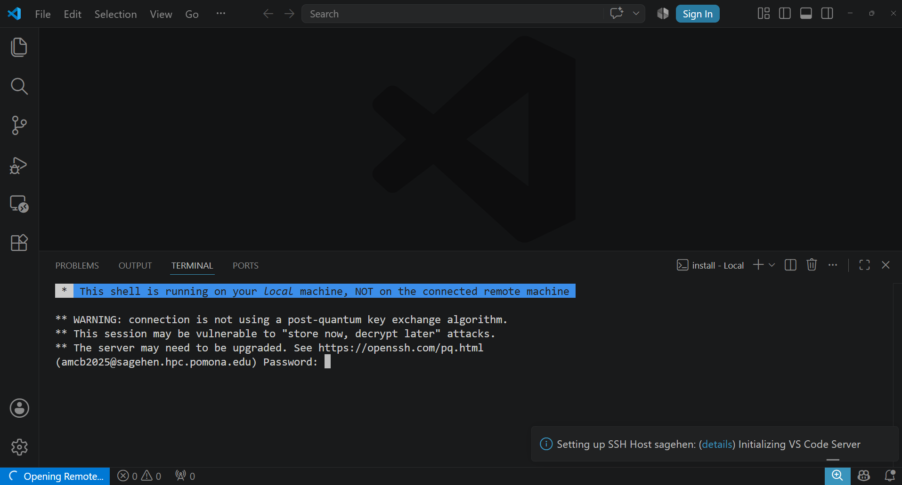

:::::::::::::::::::::::::::::::::::::: questions

- How do I connect to Sagehen using VS Code Remote-SSH?
- How do I handle DUO authentication in VS Code?
- What should I do if I get disconnected?

::::::::::::::::::::::::::::::::::::::::::::::

::::::::::::::::::::::::::::::::::::: objectives

- Connect to Sagehen HPC cluster using Remote-SSH
- Authenticate with DUO MFA through VS Code
- Open a remote folder and browse files
- Handle disconnections and reconnect

::::::::::::::::::::::::::::::::::::::::::::::

## Your First Connection

### Step 1: Open the Remote Explorer

{alt='The VS Code Remote Explorer panel open from the activity bar. Under Remotes and an SSH group, a host named sagehen appears with a green connected badge.'}

Click the **Remote Explorer** icon in the left sidebar. You should see "sagehen"
listed from your `~/.ssh/config`. If not, click the "+" icon to add a new SSH
target and enter `sagehen.hpc.pomona.edu`.

### Step 2: Connect

1. Hover over "sagehen" in the Remote Explorer
2. Click the **connect icon** (arrow pointing to a folder)
3. A new VS Code window opens
4. Select **Linux** when prompted for platform
5. Click **Yes, I trust the authors** if a trust dialog appears

### Step 3: DUO Authentication

{alt='A VS Code window mid-connection. The integrated terminal notes this shell runs on the local machine, prints OpenSSH warnings that the connection is not using a post-quantum key exchange algorithm, and shows a password prompt for the user at sagehen.hpc.pomona.edu. A notification reads Setting up SSH Host sagehen, Initializing VS Code Server.'}

::::::::::::::::::::::::::::::::::::: callout

## Completing DUO Authentication in VS Code

A terminal window appears at the bottom of VS Code:

1. Enter your Pomona password at the password prompt
2. At the DUO prompt, type a 6-digit code from your DUO app, or type "call"
3. Complete the authentication

After success, the terminal closes and VS Code shows "SSH: sagehen" in the
bottom-left status bar.

::::::::::::::::::::::::::::::::::::::::::::::

## Opening Your Remote Folder

1. Click **File > Open Folder** (or Ctrl+K Ctrl+O / Cmd+K Cmd+O)
2. Navigate to `/rhome/<myusername>` (your home directory)
3. Click **Open**

The Explorer sidebar now shows your remote files on Sagehen.

## Connection States and Reconnection

| State | Indicator | Action |
|-------|-----------|--------|
| Connected | Green "SSH: sagehen" | Working normally |
| Connecting | Blue/spinning | Wait 5-10 seconds |
| Reconnecting | Blue | VS Code auto-reconnects (~5 min) |
| Offline | Red/disconnected | Fix network, click Reconnect |

### If automatic reconnection fails:

1. Click the SSH status button (bottom-left)
2. Select "Close Remote Connection"
3. Wait a few seconds, then reconnect from Remote Explorer

For extended disconnections, close VS Code entirely, reopen, and reconnect
through Remote Explorer. You will need to re-authenticate with DUO.

## Disconnecting When Done

1. Click the "SSH: sagehen" button (bottom-left)
2. Select "Close Remote Connection"

Your files on Sagehen remain unchanged.

::::::::::::::::::::::::::::::::::::: challenge

## Challenge: Connect, Explore, and Reconnect

1. Connect to Sagehen from Remote Explorer
2. Open your home folder (`/rhome/<myusername>`)
3. Browse some folders in the Explorer sidebar
4. Disconnect (SSH button > Close Remote Connection)
5. Reconnect and verify "SSH: sagehen" reappears

::::::::::::::::::::::::::::::::::::: solution

## Solution

**Success indicators:**

- Bottom-left shows green "SSH: sagehen" button
- Explorer sidebar shows your home directory contents (`.bashrc`, project folders)
- Opening a terminal (Ctrl+\`) shows `[<myusername>@sagehen-login-1 ~]$`
- After reconnecting, the green indicator returns (faster than first connection
  since VS Code Server is already installed)

If no DUO prompt appears, verify `remote.SSH.showLoginTerminal` is enabled.

::::::::::::::::::::::::::::::::::::::::::::::

::::::::::::::::::::::::::::::::::::::::::::::

::::::::::::::::::::::::::::::::::::: keypoints

- Use Remote Explorer to connect to Sagehen and select Linux as the platform
- `remote.SSH.showLoginTerminal` must be enabled for DUO prompts to appear
- After connecting, open `/rhome/<myusername>` to browse your remote files
- VS Code automatically attempts reconnection after network interruptions
- Disconnect via the SSH status button when finished

::::::::::::::::::::::::::::::::::::::::::::::

<!-- highlight <labname>/<myusername> placeholders in code blocks; remove if the varnish theme handles this natively -->

