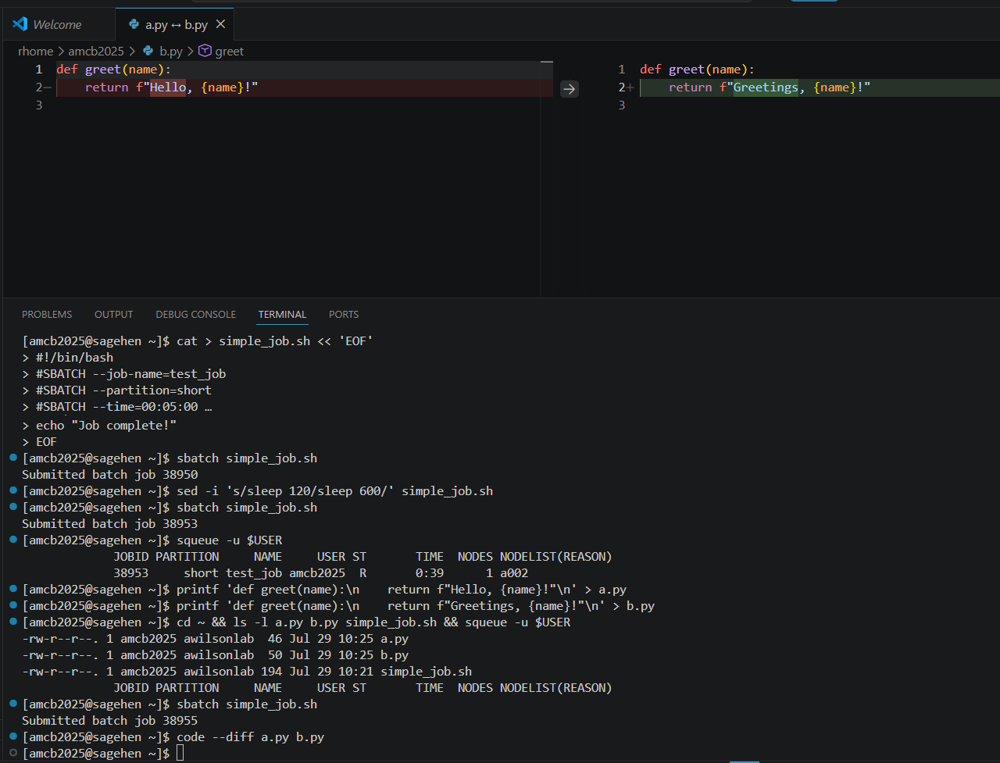

:::::::::::::::::::::::::::::::::::::: questions

- How do I work with multiple files at once?
- How do I search and replace across my project?

::::::::::::::::::::::::::::::::::::::::::::::

::::::::::::::::::::::::::::::::::::: objectives

- Use tabs and split editor for side-by-side editing
- Search and replace within a file and across all files
- Compare two files side-by-side with diff view
- Manage project folder structure from VS Code

::::::::::::::::::::::::::::::::::::::::::::::

## Working with Tabs

Each open file appears as a tab at the top of the editor:

```
|  script.py  |  data.csv  |  README.md  |
```

- Click a tab to switch files
- Click the X on a tab to close it
- Use **Ctrl+Tab** to cycle through open files

## Split Editor View

For side-by-side editing, press **Ctrl+\\** (Windows/Linux) or **Cmd+\\** (Mac):

```
|  script.py  |        |  analysis.py  |
─────────────────────────────────────────
# script.py content   # analysis.py content
```

You can have up to four splits. Drag tabs between splits to rearrange.

## Searching and Replacing

### In the current file

- **Ctrl+F** (Cmd+F): Find -- matches highlight in yellow
- **Ctrl+H** (Cmd+H): Find and Replace -- replace one or all matches

### Across all files in your project

- **Ctrl+Shift+F** (Cmd+Shift+F): Search across all files in the open folder
- **Ctrl+Shift+H** (Cmd+Shift+H): Search and replace across all files

Click any result to jump directly to that file and line.

## Comparing Files

1. Open both files
2. Right-click one file tab > **Compare with...**
3. Select the other file

Differences display side-by-side: green for added lines, red for removed, and
orange for modified lines.

{alt='A VS Code diff editor comparing two Python files side by side. Both define a greet function; the left pane highlights the line returning Hello in red as removed, and the right pane highlights the line returning Greetings in green as added.'}

## File Management

From the Explorer sidebar you can:

- **Create folders:** Right-click > New Folder
- **Rename:** Right-click > Rename
- **Delete:** Right-click > Delete (permanent on the remote system)
- **Move:** Drag files between folders

## Keyboard Shortcuts Reference

| Action | Windows/Linux | Mac |
|--------|---------------|-----|
| Quick Open | Ctrl+P | Cmd+P |
| Find in file | Ctrl+F | Cmd+F |
| Find/Replace in file | Ctrl+H | Cmd+H |
| Find in all files | Ctrl+Shift+F | Cmd+Shift+F |
| Split editor | Ctrl+\\ | Cmd+\\ |
| Close file | Ctrl+W | Cmd+W |
| Go to line | Ctrl+G | Ctrl+G |

::::::::::::::::::::::::::::::::::::: challenge

## Challenge: Side-by-Side Editing and Search

1. Create a file `utilities.py` with:

   ```python
   def greet(name):
       """Greet someone."""
       return f"Hello, {name}!"
   ```

2. Open both `hello_world.py` and `utilities.py` in split view (Ctrl+\\)
3. Use **Ctrl+Shift+H** to replace "Hello" with "Greetings" across all files
4. Undo with Ctrl+Z in each file

::::::::::::::::::::::::::::::::::::: solution

## Solution

After splitting, two editor panes appear side by side. Both files have Python
syntax highlighting. Using Ctrl+Shift+H opens the sidebar search-and-replace
which operates across all files in the workspace. After "Replace All," every
instance of "Hello" changes to "Greetings". Use Ctrl+Z in each file to undo
-- each file tracks its own undo history independently.

::::::::::::::::::::::::::::::::::::::::::::::

::::::::::::::::::::::::::::::::::::::::::::::

::::::::::::::::::::::::::::::::::::: keypoints

- Open files appear as tabs; use Ctrl+Tab to switch between them
- Split editor (Ctrl+\\) enables side-by-side editing of two or more files
- Ctrl+F searches the current file; Ctrl+Shift+F searches across all files
- Compare files with right-click > Compare to see color-coded differences
- Manage folders and files directly from the Explorer sidebar

::::::::::::::::::::::::::::::::::::::::::::::
