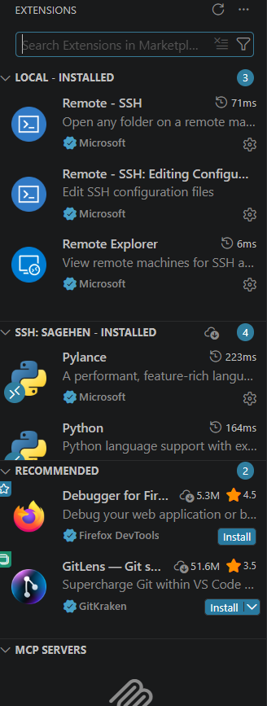

:::::::::::::::::::::::::::::::::::::: questions

- What extensions enhance my HPC workflow in VS Code?
- How do I install extensions on the remote cluster?
- What is the difference between local and remote extensions?

::::::::::::::::::::::::::::::::::::::::::::::

::::::::::::::::::::::::::::::::::::: objectives

- Understand local vs. remote extensions
- Install recommended extensions for Python, R, and Jupyter
- Configure language-specific extension settings
- Manage extensions across local and remote environments

::::::::::::::::::::::::::::::::::::::::::::::

## Local vs. Remote Extensions

::::::::::::::::::::::::::::::::::::: callout

## Extension Architecture: Where Code Runs Matters

When connected via Remote-SSH, extensions run in two places:

- **Local extensions** (your laptop): Themes, colors, UI enhancements
- **Remote extensions** (Sagehen cluster): Code analysis, linting, debugging,
  language tools

When you install an extension, VS Code tells you which type it is. Language
extensions (Python, R, Jupyter) should be installed on the remote side.

::::::::::::::::::::::::::::::::::::::::::::::

## Recommended Extensions

### Python (Essential for HPC)

Provides syntax highlighting, IntelliSense, linting, debugging, and Jupyter
notebook support.

1. Click Extensions icon (Ctrl+Shift+X)
2. Search "Python" -- find **Python** by Microsoft
3. Click Install
4. When prompted "Install in SSH: sagehen?" click **Yes**

### R (For statistical computing)

Search "R" by REditorSupport. Install in SSH: sagehen. Provides R syntax
highlighting, function documentation, and R console integration.

### Jupyter (For notebooks)

Search "Jupyter" by Microsoft. Install in SSH: sagehen. Create `.ipynb` files
and run notebook cells directly on Sagehen's compute resources.

### GitLens (Version control)

Search "GitLens." Shows blame annotations, commit history, and repository
navigation. Can be installed locally, remotely, or both.

### Markdown Preview Enhanced

Search "Markdown Preview Enhanced." Install locally for rich Markdown preview
and export to PDF.

## Essential Extensions Summary

| Extension | Install Location | Purpose |
|-----------|-----------------|---------|
| Python | Remote (SSH: sagehen) | Code analysis and debugging |
| R | Remote | R development |
| Jupyter | Remote | Interactive notebooks |
| GitLens | Local or both | Version control |
| Markdown Preview | Local | Documentation preview |

## Extension Configuration

Some extensions benefit from configuration in Settings (Ctrl+,):

```json
{
    "python.linting.enabled": true,
    "python.linting.pylintEnabled": true,
    "jupyter.interactiveWindow.textEditor.magicCommandsAsComments": true
}
```

## Managing Extensions

{alt='The VS Code Extensions sidebar while connected to Sagehen. A Local Installed section lists the Remote SSH extensions; a separate SSH SAGEHEN Installed section shows Pylance and Python installed on the cluster, with recommended extensions below.'}

- View installed extensions: Extensions sidebar shows **Local** and **Remote -
  SSH: sagehen** sections
- Extensions installed remotely stay on Sagehen even when disconnected
- Disable problematic extensions: find them in Extensions, click **Disable**
- Too many extensions can slow VS Code; keep 5-10 active

::::::::::::::::::::::::::::::::::::: challenge

## Challenge: Install Python and Test IntelliSense

1. Install the Python extension on the remote cluster
2. Create `test_intellisense.py`
3. Type `import ` and verify module suggestions appear
4. Type `math.` and see available functions
5. Hover over `math.sqrt` to see its documentation

::::::::::::::::::::::::::::::::::::: solution

## Solution

After typing `import `, a dropdown lists available modules (`math`, `os`, `sys`).
After `math.`, functions like `sqrt`, `pi`, `ceil` appear. Hovering shows the
docstring and signature. If no suggestions appear, press Ctrl+Space to trigger
manually, or check the status bar for a Python version indicator -- the extension
may still be loading. Reload with Ctrl+Shift+P > "Reload Window" if needed.

::::::::::::::::::::::::::::::::::::::::::::::

::::::::::::::::::::::::::::::::::::::::::::::

::::::::::::::::::::::::::::::::::::: keypoints

- Remote extensions run on Sagehen for language support; local extensions handle UI
- Install Python, R, and Jupyter on the remote side for full language features
- Extensions persist on Sagehen between sessions
- Keep 5-10 extensions active to maintain VS Code performance

::::::::::::::::::::::::::::::::::::::::::::::
